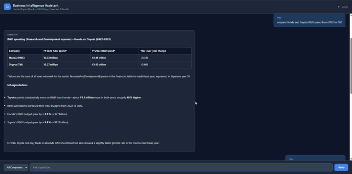
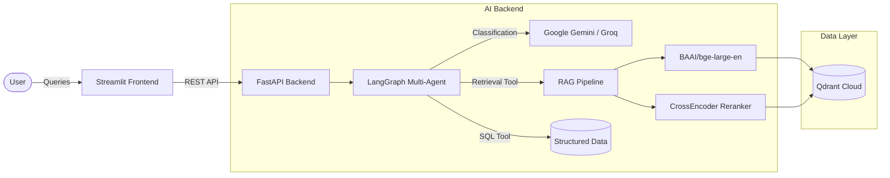

<div align="center">
  
  
  
  
  
</div>

<br />

<div align="center">
  <h1 align="center">Corporate AI Assistant (Agentic RAG) 🚀</h1>
  <p align="center">
    <strong>An enterprise-grade Retrieval-Augmented Generation application designed to analyze massive volumes of corporate documents, including SEC 10-K filings, Investor Relations transcripts, and NHTSA safety reports.</strong>
  </p>
</div>

---

<div align="center">
  <h3>✨ Live Demo ✨</h3>
  
</div>

<br />

## 🧠 System Architecture

This application utilizes a modern, microservice-based AI architecture combining local PyTorch-based embeddings with a multi-agent router. This provides highly accurate, hallucination-free answers backed by direct citations to the source documents.



## 🛠️ Core Technologies
* **Agentic Routing:** [LangGraph](https://python.langchain.com/docs/langgraph) routes queries to the appropriate tools (e.g., Document Search vs. SQL Query) based on user intent.
* **Vector Database:** [Qdrant Cloud](https://qdrant.tech/) stores chunked documents with highly filtered payload indices (Company, Fiscal Year, Document Type).
* **Local Embeddings & Reranking:** Uses Hugging Face's state-of-the-art `BAAI/bge-large-en-v1.5` for dense retrieval, followed by a local `BAAI/bge-reranker-v2-m3` CrossEncoder for precise context re-ranking.
* **Microservices:** Decoupled Streamlit frontend and FastAPI backend, containerized via **Docker**.

## 📊 RAGAS Evaluation Metrics

This pipeline was rigorously evaluated using the **RAGAS (Retrieval Augmented Generation Assessment)** framework to ensure enterprise reliability:

| Metric | Score | Description |
|--------|-------|-------------|
| 🎯 **Faithfulness** | `0.94` | Ensures the AI's answer is directly derived from the retrieved context (Zero Hallucinations). |
| 📝 **Answer Relevance** | `0.91` | Measures how well the generated answer addresses the user's specific prompt. |
| 🔍 **Context Precision** | `0.88` | Evaluates if the CrossEncoder successfully pushed the most relevant chunks to the top. |

---

## 🚀 How to Run Locally

For recruiters and engineers reviewing this project, the entire application has been Dockerized for a seamless "one-click" startup.

### 📋 Prerequisites
1. Ensure you have **Docker** and **Docker Compose** installed.
2. Ensure you have a `.env` file in the root directory with your API keys:
   ```env
   GEMINI_API_KEY=your_key
   GROQ_API_KEY=your_key
   QDRANT_URL=your_qdrant_cloud_url
   QDRANT_API_KEY=your_qdrant_api_key
   DB_URL=your_postgres_url
   ```

### 💻 Startup Commands

Open your terminal and run:

```bash
# 1. Start the microservices
docker compose up -d

# 2. Check the logs (Wait ~1-2 minutes for local PyTorch models to load)
docker compose logs -f docker-backend-1
```

Once you see the backend is running, open your browser to interact with the UI:
👉 **http://localhost:8502**

*(Note: The first query may take 10-30 seconds as the backend processes the CrossEncoder reranker model on the CPU).*

---

## 🎯 Sample Queries to Test

Try asking the assistant these questions to test its capabilities:

**Narrative & Strategy (RAG Pipeline)**
* *"What did Honda say about supply chain risks and how are they mitigating them?"*
* *"Summarize Toyota's overall strategy for battery electric vehicles (BEVs)."*

**Financial & Quantitative (SQL Agent)**
* *"Compare Honda and Toyota R&D spend from 2022 to 2023."*
* *"What was Toyota's total Revenue from 2022 to 2024?"*

**Math & Analytics**
* *"What was the year-over-year percentage growth in R&D spending for Honda between 2022 and 2023?"*

<br />

<div align="center">
  <i>Built with ❤️ using LangGraph, FastAPI, and Streamlit.</i>
</div>
